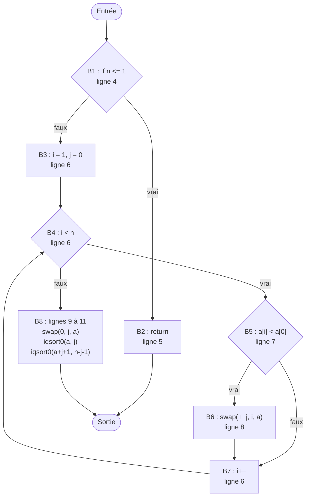

# Loan ALLARD
# Romain CANTOR
# Willem CHETIOUI


---
 
## 2.4 Mesurer un algorithme simple
 
### Code source analysé
 
Implémentation simplifiée du QuickSort :
 
```c
 1  void iqsort0(int *a, int n)
 2  {
 3      int i, j;
 4      if (n <= 1)
 5          return;
 6      for (i = 1, j = 0; i < n; i++)
 7          if (a[i] < a[0])
 8              swap(++j, i, a);
 9      swap(0, j, a);
10      iqsort0(a, j);
11      iqsort0(a + j + 1, n - j - 1);
12  }
```
 
---
 
### Graphe de flot de contrôle (CFG)
 



## 2.5 Complexité cyclomatique

---

### Nombre de nœuds **N** (B1 à B8 + Sortie) = 9 
### Nombre d'arêtes **E** = 11
### Composantes connexes **P** = 1

---
 
### $$V(G) = E - N + 2P = 11 - 9 + 2 = \mathbf{4}$$
 
### **Vérification par les prédicats** : le code contient 3 points de décision (`if (n <= 1)`, `i < n`, `if (a[i] < a[0])`), donc V(G) = 3 + 1 = **4**.
 
### Le nœud d'entrée n'est pas compté ici. L'ajouter donnerait N = 10 et E = 12, et le résultat resterait identique.
 
### **Interprétation** : il existe 4 chemins linéairement indépendants dans `iqsort0`. Il faut donc au minimum 4 cas de test pour couvrir la base de chemins. Une valeur de 4 correspond à une fonction simple, peu risquée et facile à tester.
 

